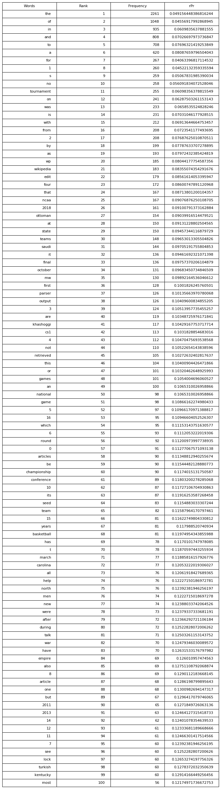

```python
%load_ext autoreload
%autoreload 2
```

    The autoreload extension is already loaded. To reload it, use:
      %reload_ext autoreload


# Imports


```python
from web_crawler import WebCrawler
from content_processor import ContentProcessor
from analyze import Analyze
import warnings
warnings.filterwarnings('ignore')
```

# WebCrawler 
 - WebCrawler can be instantiated with a csv containing seed, num_pages and domain or with keyword arguments; there is also the option to thread or not
     - Threading applies to the domain list, so it only makes sense to use with domain=''
 - Each WebCrawler instance will immediately begin crawling and upon completion will ouput a list of urls and metadata
     - Be aware that subsequent instantiations of WebCrawler override the data in the 'repository' folder


```python
# wiki_crawler = WebCrawler('specification.csv')
# wiki_crawler = WebCrawler(seed='https://en.wikipedia.org/wiki/Main_Page', threaded=True, num_pages=5, domain='en.wikipedia.org')
wiki_crawler = WebCrawler(seed='https://en.wikipedia.org/wiki/Main_Page', num_pages=5, domain='en.wikipedia.org')
```


<table><tr><td>Live URL</td><td>File</td><td>Status</td><td># Links</td><td># Images</td></tr><tr><td><a href=https://en.wikipedia.org/wiki/Main_Page>https://en.wikipedia.org/wiki/Main_Page<td><a href=repository/1.html>https://en.wikipedia.org/wiki/Main_Page</a></td><td>200</td><td>340</td><td>21</td></tr><tr><td><a href=https://en.wikipedia.org/wiki/Ramsar_site>https://en.wikipedia.org/wiki/Ramsar_site<td><a href=repository/2.html>https://en.wikipedia.org/wiki/Ramsar_site</a></td><td>200</td><td>431</td><td>5</td></tr><tr><td><a href=https://en.wikipedia.org/wiki/Wikipedia:Community_portal>https://en.wikipedia.org/wiki/Wikipedia:Community_portal<td><a href=repository/3.html>https://en.wikipedia.org/wiki/Wikipedia:Community_portal</a></td><td>200</td><td>2334</td><td>29</td></tr><tr><td><a href=https://en.wikipedia.org/wiki/Julia_Yeomans>https://en.wikipedia.org/wiki/Julia_Yeomans<td><a href=repository/4.html>https://en.wikipedia.org/wiki/Julia_Yeomans</a></td><td>200</td><td>249</td><td>5</td></tr><tr><td><a href=https://en.wikipedia.org/wiki/Wikipedia:Introduction>https://en.wikipedia.org/wiki/Wikipedia:Introduction<td><a href=repository/5.html>https://en.wikipedia.org/wiki/Wikipedia:Introduction</a></td><td>200</td><td>184</td><td>8</td></tr></table>


# Content Processor
 - A ContentProcessor instance will extract text from each html file and put it in the 'processed' folder


```python
cp = ContentProcessor()
cp.process_repository()
```

# Analysis
  - An Analyze instance will analyze the text data in the 'processed' folder
  - the plot_graph method will plot the Zipf's Law for the data
  - the plot_most_frequent method will plot a table for the first 100 most common words


```python
analysis = Analyze()
print(f'N = {analysis.total_words}')
```

    N = 45996


```python
analysis.plot_graph('Wikipedia')
```


```python
analysis.plot_most_frequent()
```





```python

```
